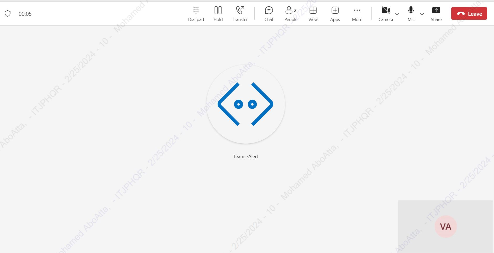
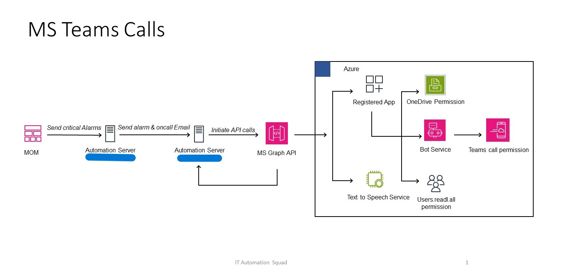
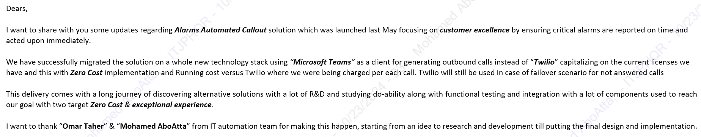

[![LinkedIn][linkedin-shield]][linkedin-url]

<!-- PROJECT LOGO -->
 

  
  <h3 align="center">Automated Microsoft Teams Calls with Azure</h3>

<!-- TABLE OF CONTENTS -->

  
Table of Contents

  <ol>
    <li><a href="#about-the-project">About The Project</a></li>
    <li><a href="#business-case">Business Case</a></li>
    <li><a href="#technical-solution">Technical Solution</a></li>
    <li><a href="#tech-stack">Tech Stack</a></li>
    <li><a href="#feedback">Feedback</a></li>
    <li><a href="#contact">Contact</a></li>
  </ol>

<!-- ABOUT THE PROJECT -->
## About The Project

* **Project Name:** Automated Microsoft Teams Calls with Azure  
* **Version:** v1.0.0  
* **Department:** Technology

---

### Business Case

This project was an update to the Alarms Automated Callout solution, launched in May 2023, aimed at ensuring critical alarms are reported and addressed in real-time. The previous system relied on Twilio for generating outbound calls, incurring per-call costs.

We migrated to Microsoft Teams as the primary client for outbound calls, utilizing existing licenses to implement a **Zero-Cost** solution. Twilio now serves as a failover in case of unanswered calls, ensuring reliability without ongoing costs.

The migration involved extensive R&D, functional testing, and integration with multiple components, all while focusing on cost efficiency and an exceptional user experience.

(<a href="#readme-top">back to top</a>)

### Technical Solution

This solution leverages Microsoft Graph API and Azure resources to initiate automated calls. API requests trigger calls directly through Microsoft Teams, reducing operational costs compared to Twilio.

**Architecture Design:**

(<a href="#readme-top">back to top</a>)

### Tech Stack

This project was developed using the following tech stack:

* **Azure Cloud Services**
* **Python**

(<a href="#readme-top">back to top</a>)

<!-- CONTACT -->
## Feedback

(<a href="#readme-top">back to top</a>)

<!-- CONTACT -->
## Contact

Mohamed AbdelGawad Ibrahim - [@m-abdelgawad](https://www.linkedin.com/in/m-abdelgawad/) - <a href="tel:+201069052620">+201069052620</a>

(<a href="#readme-top">back to top</a>)

<!-- MARKDOWN LINKS & IMAGES -->
[linkedin-shield]: https://img.shields.io/badge/-LinkedIn-black.svg?style=for-the-badge&logo=linkedin&colorB=555
[linkedin-url]: https://www.linkedin.com/in/m-abdelgawad/
